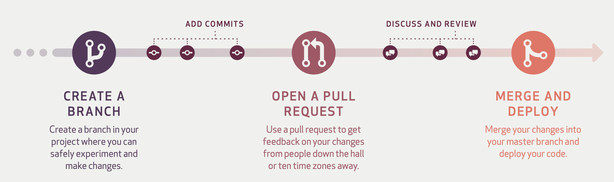
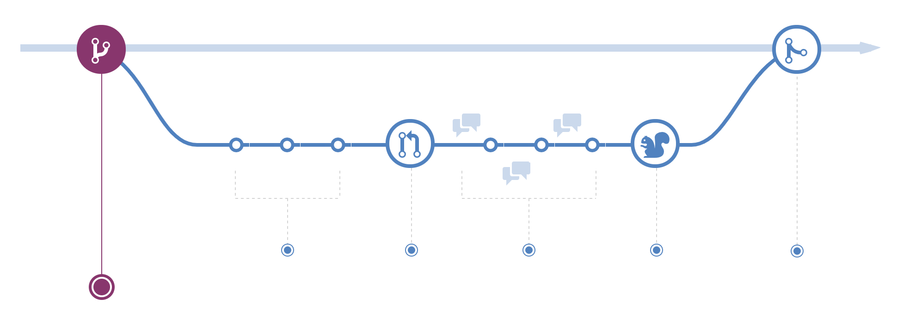
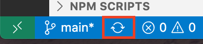
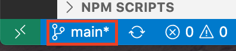
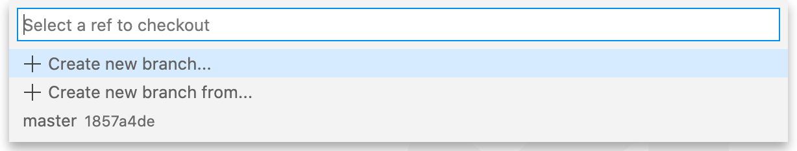
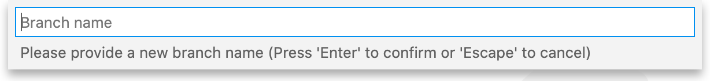
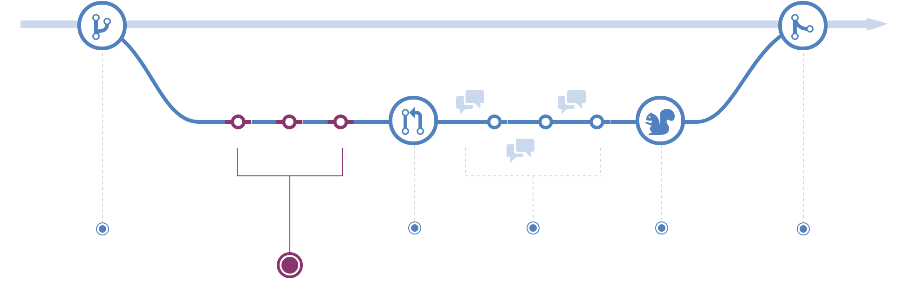
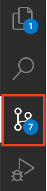

# Contributing

Thank-you for your interest in contributing to Tenrec UI. This documentation is
based (in part) on Git Hub Flow. It details all others aspects necessary to
contribute to this project and comply with our standards.



## Table of Contents

- [Development Environment](#development-environment)
- [Extensions](#extensions)
- [Branching](#branching)
  - [Creating a Branch](#creating-a-branch)
  - [Branch Naming Guidelines](#branch-naming-guidelines)
  - [Creating the Branch](#creating-the-branch-using-visual-studio-code)
- [Making Changes](#making-changes)
  - [Commit Messages](#commit-messages)
  - [Making a Commit](#making-a-commit-using-visual-studio-code)
- [Pull Requests](#pull-requests)
  - [Discussing and Reviewing Code](#discussing-and-reviewing-code)
- [Deploying](#deploying)

## Development Environment

You may use whatever tools you want to develop. We use [Visual Studio
Code](https://code.visualstudio.com/), which is a free and popular, highly
extensible cross-platform editor. You can use Git at the command line or through
an IDE. The choice is all yours.

Our examples, however, are based on the Visual Studio Code IDE and using Git
through that IDE.

### Extensions

We use a variety of extremely popular extensions in Visual Studio Code to make
our lives easier, which are listed below. You are free to use whatever
development tools and extensions that you like, however, our project has files
that are configured with these extensions to provide certain standards and any
code submitted to this project must comply with those standards.

| Extension | Available At | Purpose |
|---|---|---|
| Code Spell Checker | streetsidesoftware.code-spell-checker | Checks all files for spelling errors. There is a JSON file containing recognized words within the project. |
| ESLint | dbaeumer.vscode-eslint | Checks JS/JSX files for coding standards. |
| MarkdownLint | davidanson.vscode-markdownlint | Checks Markdown files for standards. |
| Rewrap | stkb.rewrap | Rewraps comments in compliance with ESLint standards. |
| Sort lines | tyriar.sort-lines | Sorts highlighted lines of text. |

## Branching

### Creating a Branch



The `main` branch always needs to be deployable. Therefore any changes you make,
cannot be made directly on the `main` branch. Instead, whenever you want to
create a new feature, fix a bug, or simply to try out new ideas, you need to
create a new branch off of main. That way, changes you make don't affect the
`main` branch.

### Branch Naming Guidelines

When creating a new branch, there are certain naming guidelines we would like
you to follow. These guidelines make it easy for others to know what is being
worked on.

The general naming guideline uses the following convention, which is further
described in the sections that follow:

`Prefix/Issue Number-Short-Summary`

For example:

`feature/123-add-zoom-image-component`

The example indicates that this branch contains a feature (and not a bug fix),
is described in GitHub Issue 123 and its purpose is to add a component called
Zoom Image.

#### Lower Case

All branch names should be entirely lowercase.

#### Prefixes

All branch names begin with one of the following prefixes, which depend on the
type of work being performed.

| Prefix | Description |
|---|---|
| feature | Use when developing a new feature or enhancement. |
| bug | Use when fixing a bug, outside of a feature or enhancement. |

#### Feature Branches

Feature branches are used when developing a new feature or enhancement. When
starting development, the deployment in which this feature will be released may
not be known. No matter when the feature branch will be finished, it will always
be merged back into the master branch.

During the lifespan of the feature development, you should watch the master
branch (network tool or branch tool in GitHub) to see if there have been commits
since the feature was branched. Any and all changes to master should be merged
into the feature branch (refreshing the branch) before merging back to master;
this can be done at various times during the project or at the end, but time to
handle merge conflicts should be accounted for.

#### Bug Branches

Bug branches are used when fixing a reproducible problem in an existing feature
or enhancement. Bugs are not new features and their scope should not extend
beyond the next deployment. For that reason, a bug branch typically will not
last longer than one deployment cycle. Additionally, bug branches are used to
explicitly track the difference between bug development and feature development.
No matter when the bug branch will be finished, it will always be merged back
into master.

Although likelihood will be less, during the lifespan of the bug development,
you should watch the master branch (network tool or branch tool in GitHub)
to see if there have been commits since the bug was branched. Any and all
changes to master should be merged into the bug before merging back to master;
this can be done at various times during the project or at the end, but time to
handle merge conflicts should be accounted for.

#### Issue Number

The issue number in GIT that identifies the issue being worked on.

#### Short Summary

The Issue Number and Short Summary should be separated by a hyphen. The Short
Summary is a few words in all lowercase that describe the work. For example,
`add-zoom-image-component` could be used to describe the addition of the
ZoomImage component to the project.

### Creating the Branch Using Visual Studio Code

- On the left of the status bar, click the Synchronize Changes button.



- On the left of the status bar, click the Checkout branch/tag button.



- In the Select a Ref to checkout, click Create new branch from...



- In the Branch Name, enter the name of your branch as set out in the guidelines
  above.



## Making Changes



Once you've created a [branch](BRANCHING.md), you can start to make changes to
that branch. Every time you add, edit, or delete files, the changes are tracked
and you can regularly commit them to your branch. Each commit creates a history
of your work that others can follow to understand what you've done and why. When
you commit your work, you enter a message that describes why a particular change
was made. Furthermore, each commit is considered a separate unit of change and
you can rollback your changes if you desire.

### Commit Messages

Every commit requires a commit message. By writing clear commit messages, you
can make it easier for other people to follow along and provide feedback.

A commit message is comprised of two parts: a subject line and optional body, as
described in the next two sections.

#### Subject Line

The first 50 characters is considered the subject line. The line should be
capitalized, should not end with a period, and has an imperative mood - in other
words, commanding and direct. The subject line describes `what` the commit achieves.

In general, what you write is the completion of the following sentence:

`If applied, this commit will...`

Some examples of not-so-great commit messages include:

``` text
update
testing
icon doc
fix broken test.
```

Some examples of great commit messages include:

``` text
Add support for language packs
Remove IE9/IE10 workarounds
Disable integration tests
```

#### Body

The body is an optional message that is separated from the subject line by a
blank line. Each line in the body has a limit of 72 characters in length. Many
commits don't require a body, since the subject line is sufficient. In general
the body describes `why` the change was made.

For example, this may be sufficient.

``` text
Add support for language packs
```

However, in some cases, a commit may warrant a bit more explanation. For
example, the following message may be insufficient:

``` text
Remove IE9/IE10 workarounds
```

As a result a body could be added. For example:

``` text
Remove IE9/IE10 workarounds

Both of these browsers are no longer supported in this release.
```


### Making a Commit Using Visual Studio Code

- Click the Source Control icon on the Side Bar.



- In the Message text box type the commit message using the guidelines described
  above.
- Click the Commit button at the top of the Source Control pane to commit your
  changes.


## Pull Requests


Pull Requests initiate discussion about your commits. Because they're tightly
integrated with the underlying Git repository, anyone can see exactly what
changes would be merged if they accept your request.

You can open a Pull Request at any point during the development process: when
you have little or no code but want to share some screenshots or general ideas,
when you're stuck and need help or advice, or when you're ready for someone to
review your work for it to be merged back into the main branch. By using
GitHub's @mention system in your Pull Request message, you can ask for feedback
from specific people or teams, whether they're down the hall or ten time zones
away.

### Discussing and Reviewing Code


Once a Pull Request has been opened, the person or team reviewing your changes
may have questions or comments. Perhaps the coding style doesn't match project
guidelines, the change is missing unit tests, or maybe everything looks great
and props are in order. Pull Requests are designed to encourage and capture this
type of conversation.

You can also continue to push to your branch in light of discussion and feedback
about your commits. If someone comments that you forgot to do something or if
there is a bug in the code, you can fix it in your branch and push up the
change. GitHub will show your new commits and any additional feedback you may
receive in the unified Pull Request view.

## Deploying


With GitHub, you can deploy from a branch for final testing in production before
merging to main.

Once your pull request has been reviewed and the branch passes your tests, you
can deploy your changes to verify them in production. If your branch causes
issues, you can roll it back by deploying the existing main branch into
production.

Different teams may have different deployment strategies. For some, it may be
best to deploy to a specially provisioned testing environment. For others,
deploying directly to production may be the better choice based on the other
elements in their workflow.

## Merging


Now that your changes have been verified in production, it is time to merge your
code into the main branch.

Once merged, Pull Requests preserve a record of the historical changes to your
code. Because they're searchable, they let anyone go back in time to understand
why and how a decision was made.

By incorporating certain keywords into the text of your Pull Request, you can
associate issues with code. When your Pull Request is merged, the related issues
are also closed. For example, entering the phrase Closes #32 would close issue
number 32 in the repository.


## Tests

All code must be tested. This includes new features and bug fixes. We use JEST
for all testing and strive to achieve 100% code coverage.

To run all tests and check for code coverage type:

``` bash
npm test
```

To run tests in a specific file type (example provided):

``` bash
npm test -- ./src/text-helper.test.js
```

## JavaScript Standards

We follow the AirBnB standard for all JavaScript programming. ESLint is
installed in the package and is configured to enforce these standards. Please
ensure that any tools you are using to automatically format your code are
configured to use the AirBnB standard.

## Spell Checking

We use the  Code Spell Checker VS Code extension
(streetsidesoftware.code-spell-checker) to check files for spelling mistakes. We
use US English when spelling all words (for example, color vs. colour). Please
ensure that words that are properly spelled but unrecognized are added to
cspell.json in the root folder.
