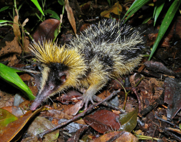
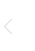
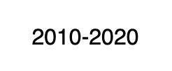
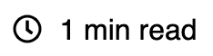

# Tenrec UI

[](https://www.gnu.org/licenses/gpl-3.0)
[](https://travis-ci.org/rabidkitten/tenrec-ui)

Tenrec UI is a set of React UI components.

## About the Name

Tenrec UI is named after the "Tenrec" - a kitten-sized, stout-bodied, nocturnal mammal endemic to Madagascar.



## Installation

The best way to consume Tenrec UI is via the npm package which you can install with [npm](https://www.npmjs.com/package/tenrec-ui) or yarn if you prefer.

```sh
// with npm
npm install tenrec-ui
```

### Importing Components

You should import individual components like `tenrec-ui/bullseye` rather than the entire library.

``` JS
import { Bullseye } from 'tenrec-ui';
```

## Why Tenrec UI

While we were aiming to use as many Material Design components as possible in our applications and web sites, there were many components that just fell short of the rich user experience that were being implemented by other companies and web sites. At that point Tenrec UI was born. If similar components are adopted by Material Design, we will work towards deprecating them (not removing them) from our library.

## Demo

You can view a demo [here](https://codesandbox.io/s/tenrec-ui-m3kor).

## Components

These are the components available in the latest version of the library:

| Component  | Example  |
|---|---|
| [Box Tail](docs/BOX-TAIL.md)  |   |
| [Bullseye](docs/BULLSEYE.md)  |  |
| [Copyright Year](docs/COPYRIGHT-YEAR.md)  |  |
| [Embossed Heading](docs/EMBOSSED-HEADING.md) |  |
| [Estimated Read Time](docs/ESTIMATED-READ-TIME.md)  |  |
| [Zoom Image](docs/ZOOM-IMAGE.md)  | N/A |


## Contributing

Contributing guidelines are available [here](CONTRIBUTING.md)

Pull requests are welcome. For major changes, please open an issue first to discuss what you would like to change.

Please make sure to update tests as appropriate.

## License

This project is licensed under the terms of the [GPLv3 license](https://choosealicense.com/licenses/gpl-3.0/).
