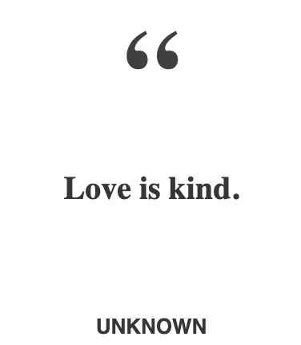
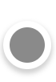
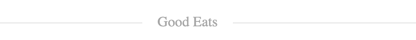
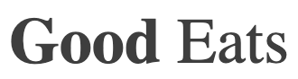
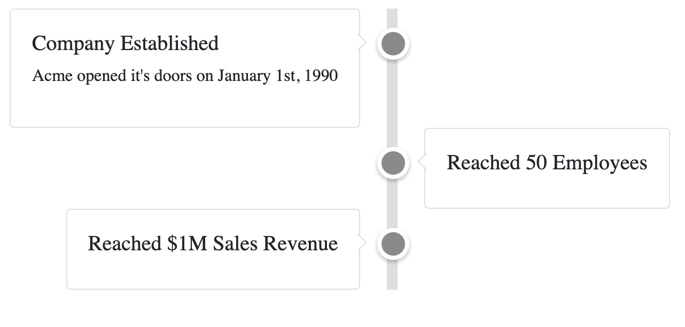

# Tenrec UI

[](https://www.gnu.org/licenses/gpl-3.0)
[](https://travis-ci.org/rabidkitten/tenrec-ui)
[](https://coveralls.io/github/rabidkitten/tenrec-ui)
[](CODE-OF-CONDUCT.md)

Tenrec UI is a set of React UI components.

## About the Name

Tenrec UI is named after the "Tenrec" - a kitten-sized, stout-bodied, nocturnal
mammal endemic to Madagascar.


## Why Tenrec UI

While we were aiming to use as many Material Design components as possible in
our applications and web sites, there were many components that just fell short
of the rich user experience that were being implemented by other companies and
web sites. At that point Tenrec UI was born. If similar components are adopted
by Material Design, we will work towards deprecating them (not removing them)
from our library.

## Installation

The best way to consume Tenrec UI is via the npm package which you can install
with [npm](https://www.npmjs.com/package/tenrec-ui) or yarn if you prefer.

```sh
// with npm
npm install tenrec-ui
```

## Usage

These are the components available in the latest version of the library:

| Component  | Example  |
|---|---|
| [Block Quote](docs/BLOCK-QUOTE.md)  |   |
| [Box Tail](docs/BOX-TAIL.md)  |   |
| [Bullseye](docs/BULLSEYE.md)  |  |
| [Divider](docs/DIVIDER.md)  |  |
| [Copyright Year](docs/COPYRIGHT-YEAR.md)  |  |
| [Emphasized Heading](docs/EMPHASIZED-HEADING.md)  |  |
| [Embossed Heading](docs/EMBOSSED-HEADING.md) |  |
| [Estimated Read Time](docs/ESTIMATED-READ-TIME.md)  |  |
| [Tag Cloud](docs/TAG-CLOUD.md)  |  |
| [Tag Cloud Tag](docs/TAG-CLOUD-TAG.md)  |  |
| [Time Line](docs/TIME-LINE.md)  |  |
| [Time Line Card](docs/TIME-LINE-CARD.md)  |  |
| [Zoom Image](docs/ZOOM-IMAGE.md)  | N/A |

### Importing Components

You should import individual components like `tenrec-ui/bullseye` rather than
the entire library.

``` JS
import { Bullseye } from 'tenrec-ui';
```

### Demo

You can view a demo [here](https://codesandbox.io/s/tenrec-ui-m3kor).

## Roadmap

See the [open issues](https://github.com/rabidkitten/tenrec-ui/issues) for a
list of proposed features (and known issues).

## Contributing

Contributing guidelines are available [here](CONTRIBUTING.md)

Pull requests are welcome. For major changes, please open an issue first to
discuss what you would like to change.

Please make sure to update tests as appropriate.

## License

This project is licensed under the terms of the [GPLv3 license](https://choosealicense.com/licenses/gpl-3.0/).
