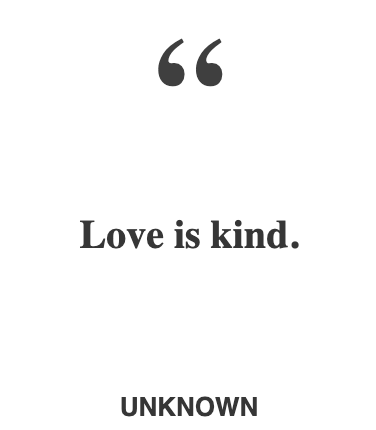

# Block Quote

Displays an quote with an attributed author.

## Examples



``` html
<BlockQuote quote="Love is kind." author="Unknown" className="tenrec" />
```

## API

| Name  | Type  | Default | Description |
|---|---|---|---|
| quote | String |  | Required. The quote. |
| author | String |  | Required. The author. |
| className | String | null | Optional. The name of an additional class to apply to the component. |
