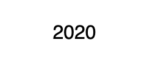

# Copyright Year

Many web pages and applications display a copyright year such as `2010` or `2010-2020`. Software developers find themselves having to write code just to achieve this effect. The CopyrightYear component displays either the current year or a specified year hyphenated with the current year. No more manually updating the copyright date of your web pages and applications.

## Examples



``` html
<CopyrightYear />
```


``` html
<CopyrightYear baseYear={2010} />
```

## API

| Name  | Type  | Default | Description |
|---|---|---|---|---|
| baseYear | Integer | null | Optional. When displaying a hyphenated year, this is the starting year. For example, in 2010-2020, this value would be 2010 |
