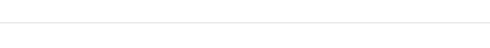
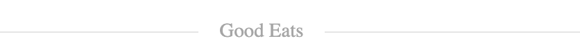
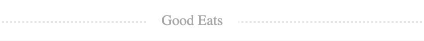

# Divider

Displays a horizontal line (similar to a horizontal rule), styled and with
optional text.

## Examples



``` html
<Divider />
```



``` html
<Divider text="Good Eats" />
```



``` html
<Divider text="Good Eats" type="dotted" />
```

## API

| Name  | Type  | Default | Description |
|---|---|---|---|
| className | String | null | Optional. The name of an additional class to apply to the component. |
| text | String |  | Optional. The text to display. |
| type | String |  | Optional. The type of line. |
