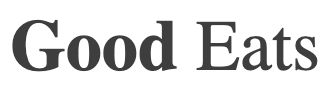

# Emphasized Heading

Displays a heading where the first word is emphasized/bolded and all subsequent
words are not. Works best visually when there are only two words.

## Examples



``` html
<EmphasizedHeading text="Good Eats" className="tenrec" />
```

## API

| Name  | Type  | Default | Description |
|---|---|---|---|
| text | String |  | Required. The text. |
| className | String | null | Optional. The name of an additional class to apply to the component. |
