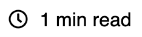

# Estimated Read Time

Popular on news articles and blogs, the EstimatedReadTime component displays the approximate amount of time it will take for an adult to read a certain amount of text.

## Examples


``` html
<EstimatedReadTime text="This is an example." />
```



``` html
<EstimatedReadTime text="This is an example." template="{time} min read" />
```

## API

| Name  | Type  | Default | Description |
|---|---|---|---|---|
| text | String | null | The text used to calculate the estimated read time. Often the text of your news article or blog. |
| template | String | null | Optional. The template to use to display the estimated time on the component. The {time} token will be replaced with the time required to read the text in minutes. |
