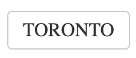

# Tag Cloud Tag

Represents a tag that appears within a tag cloud.

## Examples



``` html
<TagCloudTag tag="Toronto" size={2} className="tenrec" />
```

## API

| Name  | Type  | Default | Description |
|---|---|---|---|
| tag | String |  | Required. The tag. |
| size | Integer |  | Required. A number between 1 and 6 that is used to size the tag in relation to other tags. |
| className | String | null | Optional. The name of an additional class to apply to the component. |
