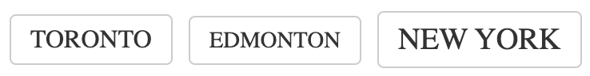

# Tag Cloud

Displays a cloud of tags (aka tag cloud).

## Examples



``` html
<TagCloud tags={[{ tag: 'dogs', value: 10 }, { tag: 'cats', value: 20 }, { tag: 'birds', value: 4 }]} className="tenrec" />
```

## API

| Name  | Type  | Default | Description |
|---|---|---|---|
| tags | Array |  | Required. An array containing the tags that appear within the cloud. See below for more details. |
| className | String | null | Optional. The name of an additional class to apply to the component. |

### Structure of Tags

The tags attribute is an array of zero or more tag elements. Each tag has the following structure:

``` json
{
  tag: 'name goes here',
  value: 10
}
```

The tag property is the name of the tag that will appear within the tag cloud.
The value is the number of that tag used to size the tag in relation to other
tags. For example, if the tag is "Dog" and there are 10 dogs in the house, then
this number would be 10.
