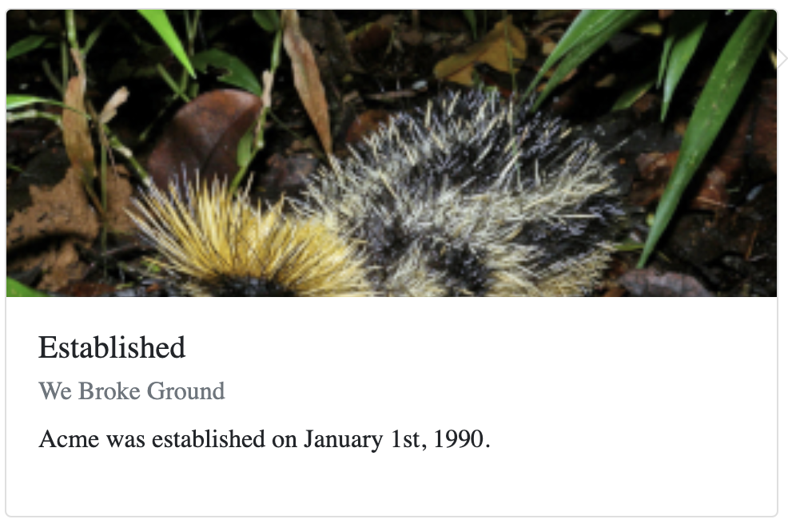

# Time Line Card

Displays a card that appears next to a time line. Although, the card can be used
for other purposes. The card displays information on a particular event on the
time line.

## Examples



``` html
<TimeLineCard
  title="Established"
  subTitle="We Broke Ground"
  text="Acme was established on January 1st, 1990."
  boxTailStyle="right"
  imageUrl="https://raw.githubusercontent.com/rabidkitten/tenrec-ui/main/docs/tenrec.jpg"
  className="tenrec"
/>
```

## API

| Name  | Type  | Default | Description |
|---|---|---|---|
| className | String | null | Optional. The name of an additional class to apply to the component. |
| imageUrl  | String | null | Optional. The relative or absolute URL of the image to display on the card. |
| boxTailStyle | String | null | Optional. A value that indicates the visibility and position of the box-tail. Use `none` (default) for no box-tail, `left` or `right`. |
| subTitle | String | null | Optional. The sub-title that appears under the title. |
| text | String | null | Optional. Text that appears in the body of the card. |
| title | String | null | Optional. The title. |
