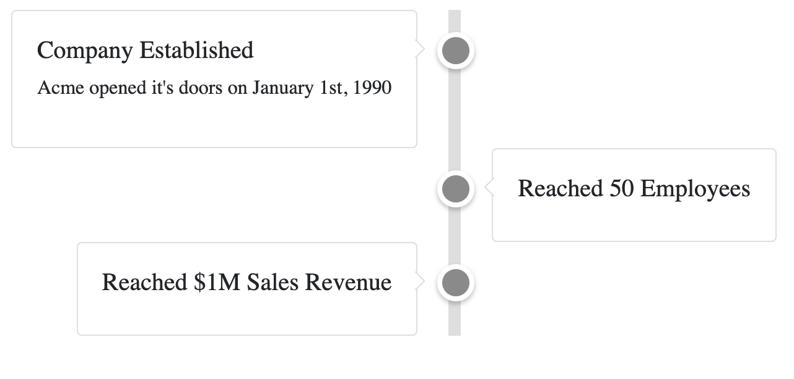

# Time Line

Displays a timeline consisting of zero or more events and can be used, for
example, to depict the major milestones of a project, a companies history, or
upcoming events.

## Examples



``` javascript
const events = [
  { title: 'Company Established', text: 'Acme opened it\'s doors on January 1st, 1990' },
  { title: 'Reached 50 Employees' },
  { title: 'Reached $1M Sales Revenue' },
];

<TimeLine events={events} />
```

## API

| Name  | Type  | Default | Description |
|---|---|---|---|
| className | String | null | Optional. The name of an additional class to apply to the component. |
| events | Array | null | Optional. The array containing events that can appear along the timeline. Each event is a JSON object that contains an optional title, subTitle, text, and imageUrl.
